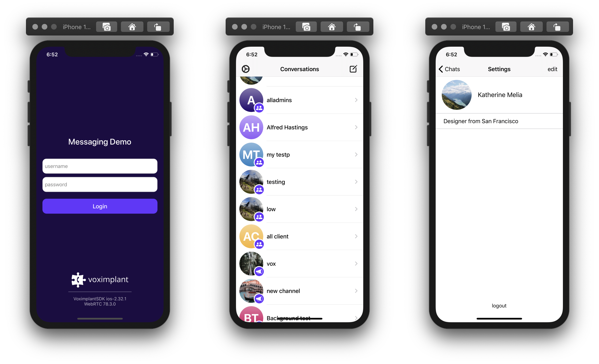
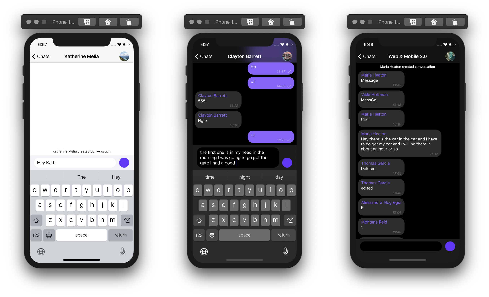
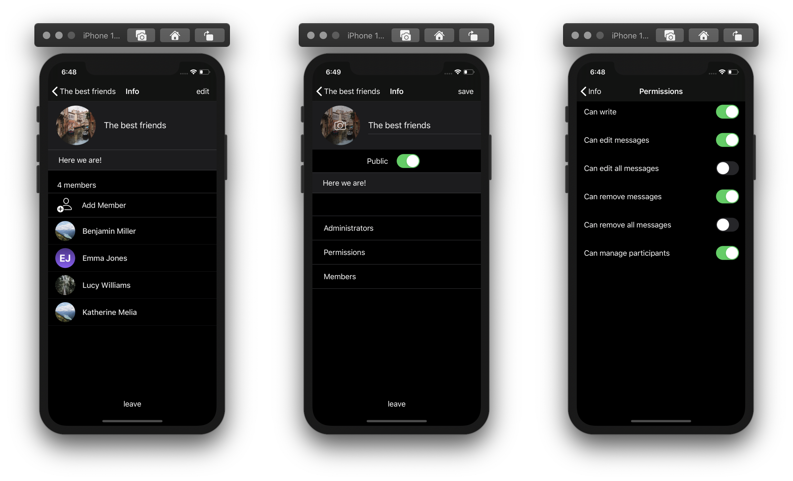
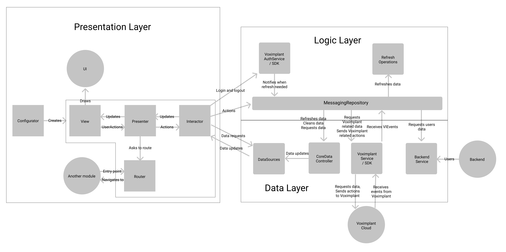

# Voximplant Messaging Demo (iOS)

This demo demonstrates messaging functionality of the Voximplant iOS SDK.

#### Features
- user authorization using password and token
- CoreData integration
- different types of conversations: direct, group chat, channel
- administrate a conversation: manage permissions, add/remove participants/administrators
- auto reconnect/relogin/refresh data
- send/edit/remove messages
- typing notifications
- mark messages as read
- iOS 13 dark mode support

## Screenshots

## Project architecture

The project is separated into 3 layers:
- Presentation (based on VIPER): resposible for UI presentation
- Business Logic: resposible for composing workflows
- Data: responsible for getting and storing the messaging data (conversations, history, users)

There are two kinds of data flow:
1. An action from UI
An action is passed to the business layer that perform the operation for the action workflow (call Voximplant Messenger API). The result is stored in the data layer that notifies Presentation layer by CoreData's NSFetchedResultControllers
2. VoximplantService (Data layer) receives a new event from the Voximplant Cloud
A new event is processed and updates the Data layer. Presentation layer is notified about any changes by CoreData's NSFetchedResultControllers

